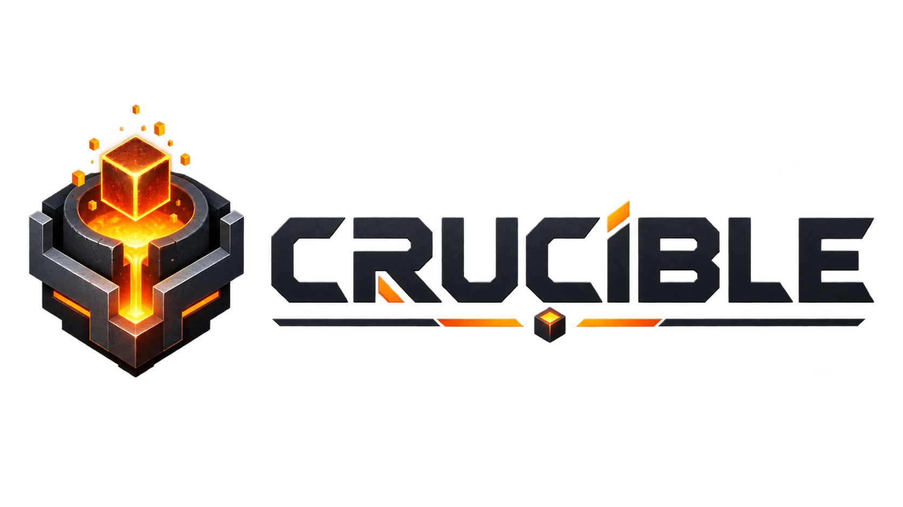

<div align="center">



### Same game. Different engine.

A high-performance, parity-focused Minecraft: Java Edition server engine written in Rust.

[](https://github.com/JamieLittle16/Crucible/actions/workflows/ci.yml)
[](LICENSE)
[](rust-toolchain.toml)
[](docs/milestones/R1X_FIRST_VISIBLE_WORLD.md)

**Strict supported vanilla fidelity. Independently designed internals. Measured performance.**

[Documentation](docs/README.md) · [Latest milestone](docs/milestones/R1X_FIRST_VISIBLE_WORLD.md) · [Architecture](docs/architecture/CRUCIBLE_MASTER_BLUEPRINT.md) · [Execution plan](docs/execution/EXECUTION_MASTER_PLAN.md) · [Contributing](CONTRIBUTING.md)

</div>

---

## What is Crucible?

Crucible is a from-scratch Minecraft: Java Edition server engine whose target is **the supported game, not Mojang's implementation architecture**.

The official server is used as a white-box and black-box semantic oracle. Crucible reconstructs those semantics behind independently designed, replaceable, data-oriented mechanisms intended to eliminate unnecessary work, scale cleanly across cores, and remain efficient on ordinary hardware.

The project is intentionally strict about the distinction between **correctness evidence** and **performance evidence**. An optimization does not become production-worthy merely because it is fast, and a plausible reimplementation does not become "vanilla" merely because common cases appear to work.

> **Freeze the laws. Benchmark the mechanisms.**

> **Everything is replaceable; indirection is optional.**

## Project status

> [!IMPORTANT]
> **Crucible remains experimental and does not yet provide a playable production server release.**
>
> On **25 August 2026**, an unmodified Minecraft: Java Edition **26.2** client completed Handshake → Login → Configuration → Play through Crucible and rendered world data. This first visible-world result used the explicitly experimental R1X target: Configuration is independently admitted, while the demonstrated early Play bootstrap is a finite captured replay and remains `production_admitted=false`.

The [R1X First Visible World milestone record](docs/milestones/R1X_FIRST_VISIBLE_WORLD.md) preserves the exact test boundary, evidence and claim limits.

Current work includes:

- target-version state data and source-backed Vanilla Atlas infrastructure;
- section representation candidates and semantic equivalence qualification;
- world/section contracts and reference implementations;
- bounded Handshake/Login/Configuration networking accepted by the stock 26.2 client;
- progressive replacement of the experimental captured Play bootstrap with source-backed, Crucible-owned live Play semantics;
- deterministic qualification, replay and evidence machinery;
- repository architecture, dependency and provenance guards;
- the handoff from correctness-qualified mechanisms to controlled performance qualification.

The next product-facing vertical slice is a **persistent walkable server**: an unmodified client connects, remains alive without captured Play replay, receives Crucible-owned chunks/light, moves and collides correctly, teleports, and reconnects. World generation is deliberately not a prerequisite for that first live slice.

### Latest milestone: R1X first visible world

The successful black-box smoke test used 34 Configuration frames (44,432 body bytes) followed by a selected 385-frame experimental Play prefix (560,569 body bytes). The client entered Play and displayed one chunk before eventually timing out after the finite replay stopped supplying continuing live-server traffic.

That result establishes the end-to-end client path through Crucible's Rust networking/session spine. It does **not** establish a production Play implementation: the next gate is live keepalive/player state, position and movement handling, inventory initialization, Crucible-owned chunk/light publication, and chunk tracking with no captured Play replay.

## Why Crucible exists

Crucible is built around four simultaneous requirements.

### 1. Semantic fidelity

Supported Minecraft behaviour is reconstructed because it has been understood and qualified, not because an implementation happens to look plausible.

### 2. Structural efficiency

Performance work starts by removing work: unnecessary scans, object creation, synchronization, copying, interpretation and repeated resolution. Instruction-level tuning comes later.

### 3. Scalable concurrency

Independent semantic work should execute in parallel without allowing worker scheduling, ownership topology or timing accidents to become gameplay.

### 4. Replaceable architecture

Important mechanisms should be independently testable and replaceable without forcing plugin-style dynamic dispatch through every hot operation.

## How Crucible establishes parity

The development pipeline is explicit:

```text
Official Mojang source
        ↓
Vanilla Algorithm Record (VAR)
        ↓
Crucible semantic rules (SEM)
        ↓
Simple reference implementation
        ↓
Vanilla parity qualification
        ↓
Optimized Crucible component
        ↓
Equivalence evidence (EQUIV)
        ↓
Performance qualification
        ↓
Integrated product slice
```

Reference implementations are permanent infrastructure, not throwaway prototypes. They provide independent oracles for differential testing, replay debugging, component substitution and optimization validation.

## Performance philosophy

Crucible does not define success as "Rust is faster than Java" or as winning isolated microbenchmarks.

For hot systems, the preferred optimization order is broadly:

1. eliminate semantically unnecessary work;
2. improve complexity;
3. stop scanning inactive state;
4. co-design algorithms and memory layout;
5. resolve generality once, then specialize inner loops;
6. batch and amortize boundaries;
7. parallelize real independence;
8. maintain coherent derived state when it is cheaper than rediscovery;
9. specialize hot representations;
10. apply SIMD, unsafe code or low-level tuning only when evidence earns it.

Performance claims are expected to carry workload identity, semantic coverage, memory effects, tail latency and reproducible evidence rather than a single flattering throughput number.

## Repository map

```text
crates/                 Rust implementation and semantic/reference components
vanilla/                Crucible-owned target-version records, fixtures and provenance metadata
docs/architecture/      product and architecture contracts
docs/qualification/     parity, equivalence and performance qualification design
docs/execution/         milestone, CI and release operating plans
docs/milestones/        durable black-box/product milestone records
profiles/               composition/profile policy
tools/                  qualification, source-indexing and repository tooling
benchmark-results/      checked-in benchmark/evidence outputs where policy permits
```

Start with the [documentation index](docs/README.md) rather than browsing the tree at random.

## Working on Crucible

The pinned toolchain is declared in [`rust-toolchain.toml`](rust-toolchain.toml). For an existing Rust installation, a normal contributor loop starts with:

```bash
git clone https://github.com/JamieLittle16/Crucible.git
cd Crucible

cargo check --workspace --all-targets --all-features --locked
cargo test --workspace --all-features --locked
cargo xtask guard
```

The ordinary CI lane additionally runs formatting, Clippy, source-backed section qualification, Python tooling tests and rustdoc with warnings denied.

Before proposing a change, read [`CONTRIBUTING.md`](CONTRIBUTING.md). Crucible intentionally uses a stricter engineering process than most early-stage projects: meaningful changes should explain their semantic effect, evidence, performance consequence, concurrency impact and architectural cost.

## Documentation

Good entry points are:

- [R1X First Visible World milestone](docs/milestones/R1X_FIRST_VISIBLE_WORLD.md) — the first stock-client Handshake → Play → visible-world black-box result and its exact claim limits.
- [Master architecture blueprint](docs/architecture/CRUCIBLE_MASTER_BLUEPRINT.md) — what the project is trying to build and why.
- [M0 foundation implementation spec](docs/architecture/M0_FOUNDATION_IMPLEMENTATION_SPEC.md) — the foundational implementation boundary.
- [World/section implementation slice](docs/architecture/WORLD_SECTION_IMPLEMENTATION_SLICE.md) — the current foundational subsystem.
- [Execution master plan](docs/execution/EXECUTION_MASTER_PLAN.md) — milestone sequencing and operating model.
- [CI qualification roadmap](docs/execution/CI_QUALIFICATION_ROADMAP.md) — how evidence becomes enforceable repository law.
- [Evidence and experiment records](docs/qualification/EVIDENCE_AND_EXPERIMENT_RECORDS.md) — how performance and correctness decisions remain reproducible.

See [`docs/README.md`](docs/README.md) for the full curated index.

## Contributing

Contributions are welcome, but Crucible deliberately optimizes for **high-confidence engineering rather than low-friction merging**.

A good contribution is narrow, source/provenance-aware, independently testable, and explicit about what would falsify its assumptions. Large speculative abstractions, silent semantic compromises and performance claims without evidence are intentionally difficult to merge.

Contributors retain ownership of their work. External contributions must also accept the [`Crucible Contributor Licence Agreement`](CLA.md); the pull-request workflow records that acceptance and fails closed when it is absent.

Read the full [contribution guide](CONTRIBUTING.md) before opening substantial work.

## Licence and project independence

Crucible is licensed under the **Mozilla Public License 2.0 (MPL-2.0)**. See [`LICENSE`](LICENSE).

Do not copy or commit Mojang source code, server JARs, game assets, worlds, credentials or other proprietary Minecraft artifacts into this repository. Official source/runtime material is a local semantic and qualification oracle and is represented in the repository only through Crucible-owned records, fingerprints, fixtures and derived evidence where permitted.

Crucible is an independent project and is not affiliated with, sponsored by, or endorsed by Mojang Studios or Microsoft. Minecraft is a trademark of Microsoft Corporation.
