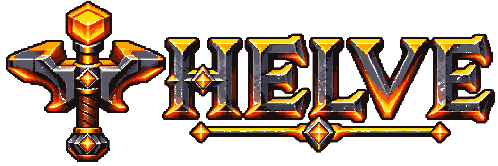

<div align="center">



### Same game. Different engine.

A high-performance, parity-focused Minecraft: Java Edition server engine written in Rust.

[](https://github.com/JamieLittle16/Helve/actions/workflows/ci.yml)
[](LICENSE)
[](rust-toolchain.toml)
[](docs/README.md)

**Strict supported vanilla fidelity. Independently designed internals. Measured performance.**

[Documentation](docs/README.md) · [Architecture](docs/architecture/CRUCIBLE_MASTER_BLUEPRINT.md) · [Execution plan](docs/execution/EXECUTION_MASTER_PLAN.md) · [Contributing](CONTRIBUTING.md)

</div>

---

## What is Helve?

Helve is a from-scratch Minecraft: Java Edition server engine whose target is **the supported game, not Mojang's implementation architecture**.

The official server is used as a white-box and black-box semantic oracle. Helve reconstructs those semantics behind independently designed, replaceable, data-oriented mechanisms intended to eliminate unnecessary work, scale cleanly across cores, and remain efficient on ordinary hardware.

The project is intentionally strict about the distinction between **correctness evidence** and **performance evidence**. An optimization does not become production-worthy merely because it is fast, and a plausible reimplementation does not become "vanilla" merely because common cases appear to work.

> **Freeze the laws. Benchmark the mechanisms.**

> **Everything is replaceable; indirection is optional.**

## Project status

> [!IMPORTANT]
> **Helve remains experimental and does not yet provide a playable production server release.**
>
> The current 26.2 development route reaches Play on an unmodified stock client with the R2B bootstrap published from Helve-owned semantic state rather than captured Play replay. The same bounded connection driver then remains live across the handoff to `WorldProjection`; R2C is the next boundary and will supply Helve-owned chunk/light/world projection.

The earlier [R1X First Visible World milestone record](docs/milestones/R1X_FIRST_VISIBLE_WORLD.md) remains durable historical evidence for the first visible-world result and its finite-replay claim limits. R2B has since removed captured Play publication from the entry/bootstrap path.

Current work includes:

- target-version state data and source-backed Vanilla Atlas infrastructure;
- section representation candidates and semantic equivalence qualification;
- world/section contracts and reference implementations;
- bounded Handshake/Login/Configuration networking accepted by the stock 26.2 client;
- replay-free, Helve-owned Play bootstrap and continuing keep-alive/teleport control;
- R2C world/chunk/light projection on the same live connection;
- deterministic qualification, replay and evidence machinery;
- repository architecture, dependency and provenance guards;
- the handoff from correctness-qualified mechanisms to controlled performance qualification.

The next product-facing vertical slice is a **persistent walkable server**: an unmodified client connects, remains alive without captured Play replay, receives Helve-owned chunks/light, moves and collides correctly, teleports, and reconnects. World generation is deliberately not a prerequisite for that first live slice.

### Current boundary: R2B → R2C

R2B establishes replay-free Play entry and keeps the original bounded connection driver alive after the bootstrap. It owns initial player state, command/recipe projection, teleport, liveness and the explicit `WorldProjection` seam. The temporary development owner can keep the client alive while R2C is not yet implemented, but it deliberately does not pretend to own world semantics.

R2C will make that seam real by publishing Helve-owned world, chunk and light state. That is the remaining distinction between "the stock client enters and stays in Play" and the first genuinely usable persistent server slice.

## Why Helve exists

Helve is built around four simultaneous requirements.

### 1. Semantic fidelity

Supported Minecraft behaviour is reconstructed because it has been understood and qualified, not because an implementation happens to look plausible.

### 2. Structural efficiency

Performance work starts by removing work: unnecessary scans, object creation, synchronization, copying, interpretation and repeated resolution. Instruction-level tuning comes later.

### 3. Scalable concurrency

Independent semantic work should execute in parallel without allowing worker scheduling, ownership topology or timing accidents to become gameplay.

### 4. Replaceable architecture

Important mechanisms should be independently testable and replaceable without forcing plugin-style dynamic dispatch through every hot operation.

## How Helve establishes parity

The development pipeline is explicit:

```text
Official Mojang source
        ↓
Vanilla Algorithm Record (VAR)
        ↓
Helve semantic rules (SEM)
        ↓
Simple reference implementation
        ↓
Vanilla parity qualification
        ↓
Optimized Helve component
        ↓
Equivalence evidence (EQUIV)
        ↓
Performance qualification
        ↓
Integrated product slice
```

Reference implementations are permanent infrastructure, not throwaway prototypes. They provide independent oracles for differential testing, replay debugging, component substitution and optimization validation.

## Performance philosophy

Helve does not define success as "Rust is faster than Java" or as winning isolated microbenchmarks.

For hot systems, the preferred optimization order is broadly:

1. eliminate semantically unnecessary work;
2. improve complexity;
3. stop scanning inactive state;
4. co-design algorithms and memory layout;
5. resolve generality once, then specialize inner loops;
6. batch and amortize boundaries;
7. parallelize real independence;
8. maintain coherent derived state when it is cheaper than rediscovery;
9. specialize hot representations;
10. apply SIMD, unsafe code or low-level tuning only when evidence earns it.

Performance claims are expected to carry workload identity, semantic coverage, memory effects, tail latency and reproducible evidence rather than a single flattering throughput number.

## Repository map

```text
crates/                 Rust implementation and semantic/reference components
vanilla/                Helve-owned target-version records, fixtures and provenance metadata
docs/architecture/      product and architecture contracts
docs/qualification/     parity, equivalence and performance qualification design
docs/execution/         milestone, CI and release operating plans
docs/milestones/        durable black-box/product milestone records
profiles/               composition/profile policy
tools/                  qualification, source-indexing and repository tooling
benchmark-results/      checked-in benchmark/evidence outputs where policy permits
```

Start with the [documentation index](docs/README.md) rather than browsing the tree at random.

## Working on Helve

The pinned toolchain is declared in [`rust-toolchain.toml`](rust-toolchain.toml). A normal contributor loop starts with:

```bash
git clone https://github.com/JamieLittle16/Helve.git
cd Helve

cargo check --workspace --all-targets --all-features --locked
cargo test --workspace --all-features --locked
cargo xtask guard
```

The repository and active Cargo/Rust namespaces now use **Helve** / `helve-*` / `helve_*`. Historical `CRUCIBLE_*` document filenames and sealed evidence identifiers are retained where renaming them would rewrite durable provenance rather than current project identity.

The ordinary CI lane additionally runs formatting, Clippy, source-backed section qualification, Python tooling tests and rustdoc with warnings denied.

Before proposing a change, read [`CONTRIBUTING.md`](CONTRIBUTING.md). Helve intentionally uses a stricter engineering process than most early-stage projects: meaningful changes should explain their semantic effect, evidence, performance consequence, concurrency impact and architectural cost.

## Documentation

Good entry points are:

- [R1X First Visible World milestone](docs/milestones/R1X_FIRST_VISIBLE_WORLD.md) — historical evidence for the first stock-client Handshake → Play → visible-world black-box result and its exact finite-replay claim limits.
- [Master architecture blueprint](docs/architecture/CRUCIBLE_MASTER_BLUEPRINT.md) — what the project is trying to build and why. The stable filename predates the Helve rename.
- [M0 foundation implementation spec](docs/architecture/M0_FOUNDATION_IMPLEMENTATION_SPEC.md) — the foundational implementation boundary.
- [World/section implementation slice](docs/architecture/WORLD_SECTION_IMPLEMENTATION_SLICE.md) — the current foundational subsystem.
- [Execution master plan](docs/execution/EXECUTION_MASTER_PLAN.md) — milestone sequencing and operating model.
- [CI qualification roadmap](docs/execution/CI_QUALIFICATION_ROADMAP.md) — how evidence becomes enforceable repository law.
- [Evidence and experiment records](docs/qualification/EVIDENCE_AND_EXPERIMENT_RECORDS.md) — how performance and correctness decisions remain reproducible.

See [`docs/README.md`](docs/README.md) for the full curated index.

## Contributing

Contributions are welcome, but Helve deliberately optimizes for **high-confidence engineering rather than low-friction merging**.

A good contribution is narrow, source/provenance-aware, independently testable, and explicit about what would falsify its assumptions. Large speculative abstractions, silent semantic compromises and performance claims without evidence are intentionally difficult to merge.

Contributors retain ownership of their work. External contributions must also accept the contributor licence agreement in [`CLA.md`](CLA.md); the pull-request workflow records that acceptance and fails closed when it is absent.

Read the full [contribution guide](CONTRIBUTING.md) before opening substantial work.

## Licence and project independence

Helve is licensed under the **Mozilla Public License 2.0 (MPL-2.0)**. See [`LICENSE`](LICENSE).

Do not copy or commit Mojang source code, server JARs, game assets, worlds, credentials or other proprietary Minecraft artifacts into this repository. Official source/runtime material is a local semantic and qualification oracle and is represented in the repository only through Helve-owned records, fingerprints, fixtures and derived evidence where permitted.

Helve is an independent project and is not affiliated with, sponsored by, or endorsed by Mojang Studios or Microsoft. Minecraft is a trademark of Microsoft Corporation.
